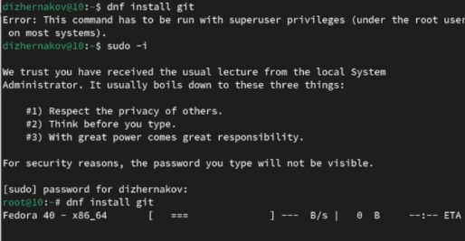
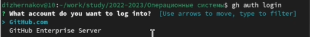
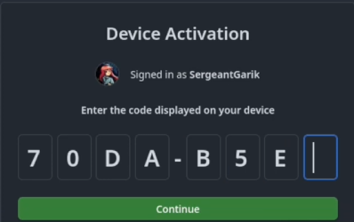

---
## Front matter
title: "Отчёта по лабораторной работе №2"
subtitle: "Дисциплина: Операционные системы"
author: "Жернаков Данила Иванович"

## Generic otions
lang: ru-RU
toc-title: "Содержание"

## Bibliography
bibliography: bib/cite.bib
csl: pandoc/csl/gost-r-7-0-5-2008-numeric.csl

## Pdf output format
toc: true # Table of contents
toc-depth: 2
lof: true # List of figures
lot: true # List of tables
fontsize: 12pt
linestretch: 1.5
papersize: a4
documentclass: scrreprt
## I18n polyglossia
polyglossia-lang:
  name: russian
  options:
	- spelling=modern
	- babelshorthands=true
polyglossia-otherlangs:
  name: english
## I18n babel
babel-lang: russian
babel-otherlangs: english
## Fonts
mainfont: PT Serif
romanfont: PT Serif
sansfont: PT Sans
monofont: PT Mono
mainfontoptions: Ligatures=TeX
romanfontoptions: Ligatures=TeX
sansfontoptions: Ligatures=TeX,Scale=MatchLowercase
monofontoptions: Scale=MatchLowercase,Scale=0.9
## Biblatex
biblatex: true
biblio-style: "gost-numeric"
biblatexoptions:
  - parentracker=true
  - backend=biber
  - hyperref=auto
  - language=auto
  - autolang=other*
  - citestyle=gost-numeric
## Pandoc-crossref LaTeX customization
figureTitle: "Рис."
tableTitle: "Таблица"
listingTitle: "Листинг"
lofTitle: "Список иллюстраций"
lotTitle: "Список таблиц"
lolTitle: "Листинги"
## Misc options
indent: true
header-includes:
  - \usepackage{indentfirst}
  - \usepackage{float} # keep figures where there are in the text
  - \floatplacement{figure}{H} # keep figures where there are in the text
---

# Цель работы

Изучение идеологии и применениния средств контроля версий, а также освоение умения по работе с git.

# Задание

1. Установить программное обеспечение.
2. Настроить git.
3. Создать ключи ssh.
4. Создать ключи pgp.
5. Настроить github.
6. Добавить PGP ключь в GitHub.
7. Настроить автоматические подписи коммитов git.
8. Настроить gh.
9. Создать репозиторий курса на основе шаблона.
10. Настроить каталог курса.

# Выполнение лабораторной работы

## Установка программного обеспечения

### Установка git

Устанавливаем git, введя *dnf install git* (рис. [-@fig:001])

{#fig:001 width=70%}

### Установка gh

Устанавливаем gh, введя *dnf install gh* (рис. [-@fig:002])

{#fig:002 width=70%}

## Базовая настройка git

Задаём имя и email владельца репозитория (рис. [-@fig:003])

{#fig:003 width=70%}

Настраиваем utf-8 в выводе сообщений git с помощью *git config --global core.quotepath false* (рис. [-@fig:004])

{#fig:004 width=70%}

Задаём имя начальной ветки (будем называть её master). Для этого мы вводим команду *git config --global init.defaultBranch master* (рис. [-@fig:005])

{#fig:005 width=70%}

Вводим параметры *autocrlf* и *safecrlf* рис. [-@fig:006])

{#fig:006 width=70%}

## Создание ключей ssh

Создаём ключ ssh по алгоритму rsa с ключём размером 4096 бит, введя команду *ssh-keygen -t rsa -b 4096* (рис. [-@fig:007])

{#fig:007 width=70%}

Далее создаём ключ ssh по алгоритму ed25519, введя *ssh-keygen -t ed25519* (рис. [-@fig:008])

{#fig:008 width=70%}

## Создание ключей pgp

Генерируем ключ, с помощью *gpg --full-generate-key* и указываем нужные данные при создании (рис. [-@fig:009])

{#fig:009 width=70%}

При создании ключа, у нас потребуют придумать пароль. Вводим пароль и всё готово! (рис. [-@fig:010]), (рис. [-@fig:011])

{#fig:010 width=70%}

{#fig:011 width=70%}

## Настройка github

В прошлом семестре я уже создала аккаунт github. Поэтому мне ничего настраивать не нужно (рис. [-@fig:012])

{#fig:012 width=70%}

## Добавление PGP ключа в GitHub

Выводим список ключей и копируем отпечаток приватного ключа, введя команду *gpg --list-secret-keys --keyid-format LONG* (рис. [-@fig:013])

{#fig:013 width=70%}

Копируем отпечаток ключа.

Далее копируем наш сгенерированный PGP ключ в буфер обмена, с помощью команды *gpg --armor --export <отпечаток ключа> | xclip -sel clip* (рис. [-@fig:014])

{#fig:014 width=70%}

У меня не сработала эта комнада, поэтому я с помощью команды *pg --armor --export <отпечаток ключа>* посмотрела мой сгенерирнованный ключ и скопировала его ручками (рис. [-@fig:015])

{#fig:015 width=70%}

Далее переходим в настройки GitHub (https://github.com/settings/keys), нажимаем на кнопку New GPG key и вставляем полученный ключ в поле ввода (рис. [-@fig:016]), (рис. [-@fig:017])

{#fig:016 width=70%}

{#fig:017 width=70%}

## Настройка автоматических подписей коммитов git

Используя введёный email, указываем Git применять его при подписи коммитов (рис. [-@fig:018])

{#fig:018 width=70%}

## Настройка gh

Для начала нам необходимо авторизоваться. Для этого вводим команду *gh auth login*. Мы авторизуемся через браузер (рис. [-@fig:019]), (рис. [-@fig:020]), (рис. [-@fig:021]), (рис. [-@fig:022]), (рис. [-@fig:023])

{#fig:019 width=70%}

{#fig:020 width=70%}

{#fig:021 width=70%}

{#fig:022 width=70%}

{#fig:023 width=70%}

## Шаблон для рабочего пространства

### Создание репозитория курса на основе шаблона

Создаём репозиторий курса на основе шаблона (рис. [-@fig:024]), (рис. [-@fig:025])

{#fig:024 width=70%}

{#fig:025 width=70%}

### Настройка каталога курса

Переходим в каталог курса (рис. [-@fig:026])

{#fig:026 width=70%}

Удаляем все лишние файлы, введя *rm package.json* (рис. [-@fig:027])

{#fig:027 width=70%}

Создаём необходимые каталоги (рис. [-@fig:028])

{#fig:028 width=70%}

Далее отправляем файлы на сервер. Вводим команды *git add .* и *git commit -am 'feat(main): make course structure'*. После этого вводим наш пароль (рис. [-@fig:029]), (рис. [-@fig:030]), (рис. [-@fig:031])

{#fig:029 width=70%}

{#fig:030 width=70%}

{#fig:031 width=70%}

Отправляем файлы на сервер, введя *git push* (рис. [-@fig:032])

{#fig:032 width=70%}

# Контрольные вопросы + ответы

1. Что такое системы контроля версий (VCS) и для решения каких задач они предназначаются?

Система контроля версий (Version Control System, VCS) представляет собой программное обеспечение, которое позволяет отслеживать изменения в документах, при необходимости производить их откат, определять, кто и когда внес исправления и т.п.

2. Объясните следующие понятия VCS и их отношения: хранилище, commit, история, рабочая копия.

хранилище - это репозиторий, в котором хранятся все файлы и документы, включая историю изменений.
commit - отслеживание и сохранение изменений.
история - созраняет в себе изменения проекта на всех этапах.
рабочая копия - - копия проекта, связанная с репозиторием.

3. Что представляют собой и чем отличаются централизованные и децентрализованные VCS? Приведите примеры VCS каждого вида.

Централизованные VCS: В централизованных VCS весь код и его история хранятся в одном центральном репозитории. Разработчики работают с копией основного репозитория на своих локальных машинах, откуда отправляют изменения в центральное хранилище.

Примеры:
- Subversion (SVN): Один из популярных централизованных VCS. Разработчики могут коммитить изменения в центральный репозиторий и обновлять свои локальные копии.
- Perforce: Еще один пример системы контроля версий с централизованным подходом, который широко применяется в больших коммерческих проектах.
 
Децентрализованные VCS: Децентрализованные VCS позволяют каждому участнику проекта иметь полноценную копию всего репозитория. Это означает, что разработчики имеют доступ ко всей истории проекта локально и могут работать независимо от подключения к сети.

Примеры:
- Git: Самая популярная децентрализованная система контроля версий. Разработчики могут коммитить, откатывать изменения и создавать ветки без необходимости доступа к центральному серверу.
- Mercurial: Еще один пример децентрализованной VCS, обеспечивающий высокую скорость работы и гибкость в управлении кодом.

4. Опишите действия с VCS при единоличной работе с хранилищем.

При единоличной работе с хранилищем (репозиторием) в системе контроля версий (VCS), разработчик ведет работу над кодом самостоятельно без коллективного взаимодействия. В такой ситуации основной упор делается на сохранение версий кода и отслеживание изменений для личного удобства и безопасности. Вот основные действия, которые могут выполняться при единоличной работе с хранилищем:

- Инициализация репозитория
- Клонирование репозитория
- Коммит изменений
- Просмотр истории изменений
- Создание веток
- Обновление репозитория
- Удаление, перемещение файлов
- Откат изменений
- Игнорирование файлов
- Резервное копировани

5. Опишите порядок работы с общим хранилищем VCS.

Работа с общим хранилищем (репозиторием) в системе контроля версий (VCS) включает в себя совместную работу нескольких разработчиков над одним проектом. Вот порядок действий при работе с общим хранилищем VCS:

- Создание или клонирование репозитория
- Получение последних изменений
- Внесение изменений
- Коммит
- Отправка изменений (push)
- Работа с веткам
и т.д.

6. Каковы основные задачи, решаемые инструментальным средством git?

Основные задачи, решаемые инструментальным средством Git, включают в себя управление версиями кода, обеспечение совместной работы над проектами, отслеживание изменений, создание и объединение ветвей разработки, а также возможность отката к предыдущим версиям кода. Git также предоставляет возможность создания резервных копий (backup) и управление изменениями в коде, что делает его ключевым инструментом для разработчиков программного обеспечения.  

7. Назовите и дайте краткую характеристику командам git.

- git init - создание основного дерева репозитория
- git pull - получение обновлений (изменений) текущего дерева из центрального репозитория
- git push - отправка всех произведённых изменений локального дерева в центральный репозиторий
- git status - просмотр списка изменённых файлов в текущей директории
- git diff - просмотр текущих изменений
- git add . - добавить все изменённые и/или созданные файлы и/или каталоги
- git add имена_файлов - добавить конкретные изменённые и/или созданные файлы и/или каталоги
- git rm имена_файлов - удалить файл и/или каталог из индекса репозитория (при этом файл и/или каталог остаётся в локальной директории)
- git commit -am 'Описание коммита' - сохранить все добавленные изменения и все изменённые файлы
- git commit - сохранить доба- вленные изменения с внесением комментария через встроенный редактор
- git checkout -b имя_ветки - создание новой ветки, базирующейся на текущей
- git checkout имя_ветки - переключение на некоторую ветку
- git push origin имя_ветки - отправка изменений конкретной ветки в центральный репозиторий
- git merge --no-ff имя_ветки - слияние ветки с текущим деревом
- git branch -d имя_ветки - удаление локальной уже слитой с основным деревом ветки
- git branch -D имя_ветки принудительное удаление локальной ветки
- git push origin :имя_ветки удаление ветки с центрального репозитория

8. Приведите примеры использования при работе с локальным и удалённым репозиториями.

Git pull:
Команда git pull используется для извлечения и загрузки содержимого из удаленного репозитория и немедленного обновления локального репозитория этим содержимым. Слияние удаленных вышестоящих изменений в локальный репозиторий — это обычное дело в процессе совместной работы на основе Git.

9. Что такое и зачем могут быть нужны ветви (branches)?

Ветви (branches) в контексте систем контроля версий, таких как Git, представляют собой параллельные линии разработки, которые позволяют команде разработчиков работать над отдельными фрагментами кода независимо друг от друга. Ветви могут быть полезны для разработки новых функций, исправления ошибок, экспериментов с кодом и поддержания стабильной основной версии программного обеспечения. Создание и использование ветвей помогает упростить процесс разработки, избегая конфликтов и обеспечивая возможность параллельной работы над различными задачами.

10. Как и зачем можно игнорировать некоторые файлы при commit?

Игнорируемый файл — файл, явным образом помеченный для Git как файл, который необходимо игнорировать.

Игнорируемые файлы — это, как правило, артефакты сборки и файлы, генерируемые машиной из исходных файлов в вашем репозитории, либо файлы, которые по какой-либо иной причине не должны попадать в коммиты. Вот некоторые распространенные примеры таких файлов (например: /bin, .lock, .tmp, /packages)

Игнорируемые файлы отслеживаются в специальном файле .gitignore, который регистрируется в корневом каталоге репозитория. В Git нет специальной команды для указания игнорируемых файлов: вместо этого необходимо вручную отредактировать файл .gitignore, чтобы указать в нем новые файлы, которые должны быть проигнорированы. Файлы .gitignore содержат шаблоны, которые сопоставляются с именами файлов в репозитории для определения необходимости игнорировать эти файлы.

# Выводы

В ходе выполнения лабораторной работы мы изучили идеологию и применениние средств контроля версий, а также освоили умения по работе с git.

# Список литературы

1. Лаборатораня работа №2 [Электронный ресурс] URL: https://esystem.rudn.ru/mod/page/view.php?id=1098933
2. GitHub [Электронный ресурс] URL: https://github.com/
