---
## Front matter
title: "Отчёт по лабораторной работе №4"
subtitle: "Дисциплина: Операционные системы"
author: ":thyfrjd Lfybkf Bdfyjdbx"

## Generic otions
lang: ru-RU
toc-title: "Содержание"

## Bibliography
bibliography: bib/cite.bib
csl: pandoc/csl/gost-r-7-0-5-2008-numeric.csl

## Pdf output format
toc: true # Table of contents
toc-depth: 2
lof: true # List of figures
lot: true # List of tables
fontsize: 12pt
linestretch: 1.5
papersize: a4
documentclass: scrreprt
## I18n polyglossia
polyglossia-lang:
  name: russian
  options:
	- spelling=modern
	- babelshorthands=true
polyglossia-otherlangs:
  name: english
## I18n babel
babel-lang: russian
babel-otherlangs: english
## Fonts
mainfont: PT Serif
romanfont: PT Serif
sansfont: PT Sans
monofont: PT Mono
mainfontoptions: Ligatures=TeX
romanfontoptions: Ligatures=TeX
sansfontoptions: Ligatures=TeX,Scale=MatchLowercase
monofontoptions: Scale=MatchLowercase,Scale=0.9
## Biblatex
biblatex: true
biblio-style: "gost-numeric"
biblatexoptions:
  - parentracker=true
  - backend=biber
  - hyperref=auto
  - language=auto
  - autolang=other*
  - citestyle=gost-numeric
## Pandoc-crossref LaTeX customization
figureTitle: "Рис."
tableTitle: "Таблица"
listingTitle: "Листинг"
lofTitle: "Список иллюстраций"
lotTitle: "Список таблиц"
lolTitle: "Листинги"
## Misc options
indent: true
header-includes:
  - \usepackage{indentfirst}
  - \usepackage{float} # keep figures where there are in the text
  - \floatplacement{figure}{H} # keep figures where there are in the text
---

# Цель работы

Получить навыки правильной работы с репозиториями git.

# Задание

1. Установить программное обеспечение.
2. Выполнить работу для тестового репозитория.
3. Преобразовать рабочий репозиторий в репозиторий с git-flow и conventional commits.

# Выполнение лабораторной работы

## Установка git-flow

Переключаемся на супер-пользователя и устанавливаем git-flow введя 2 команды:
- *dnf copr enable elegos/gitflow*
- *dnf install gitflow* (рис. [-@fig:001]), (рис. [-@fig:002])

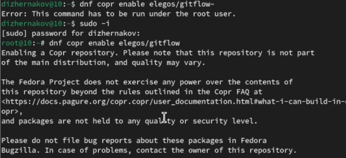{#fig:001 width=70%}

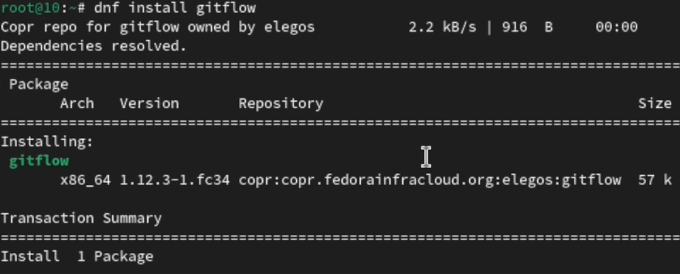{#fig:002 width=70%}

## Установка Node.js

Далее устанавливаем Node.js введя 2 команды:
- *dnf install nodejs*
- *dnf install pnpm* (рис. [-@fig:003]), (рис. [-@fig:004])

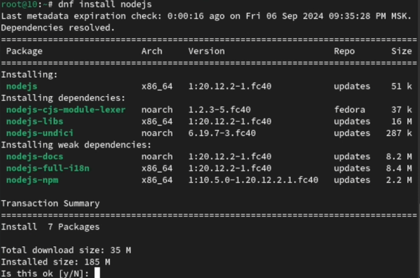{#fig:003 width=70%}

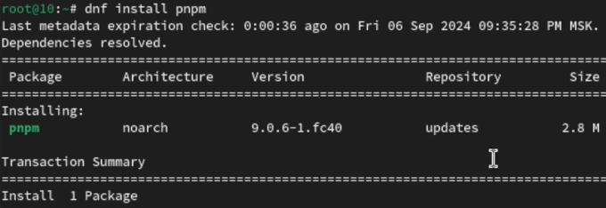{#fig:004 width=70%}

## Настройка Node.js

Запускаем pnpm с помощью *pnpm setup*, далее выполняем команду *source ~/.bashrc* (рис. [-@fig:005]), (рис. [-@fig:006])

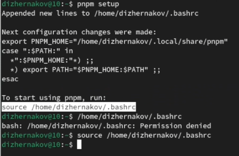{#fig:005 width=70%}

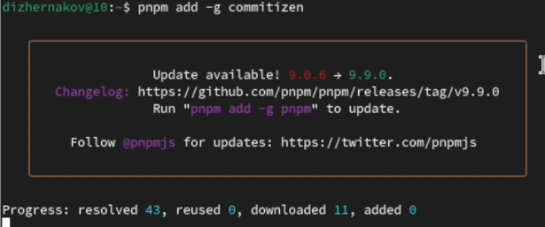{#fig:006 width=70%}

## Общепринятые коммиты

Устанавливаем пакет commitizen с помощью команды *pnpm add -g commitizen*. Данная программа используется для помощи в форматировании коммитов (рис. [-@fig:007])

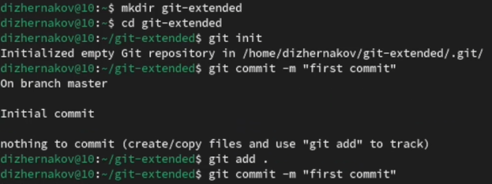{#fig:007 width=70%}

Устанавливаем пакет standard-changelog с помощью команды *pnpm add -g standard-changelog*. Данная программа используется для помощи в создании логов (рис. [-@fig:008])

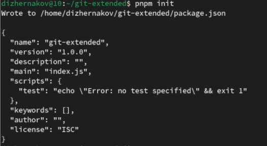{#fig:008 width=70%}

Создаём репозиторий на GitHub. Называем его git-extended (рис. [-@fig:009])

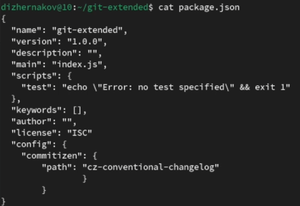{#fig:009 width=70%}

Далее клонируем созданный репозиторий, с помощью *git clone --recursive* (рис. [-@fig:010])

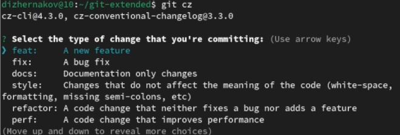{#fig:010 width=70%}

Создаём пустой файл, чтобы активировать репозиторий, делаем первый коммит и выкладываем на github, введя нижеперечисленные команды:
- git commit -m "first commit"
- git remote add origin https://github.com/<username>/git-extended.git
- git push -u origin master (рис. [-@fig:011]), (рис. [-@fig:012]), (рис. [-@fig:013])

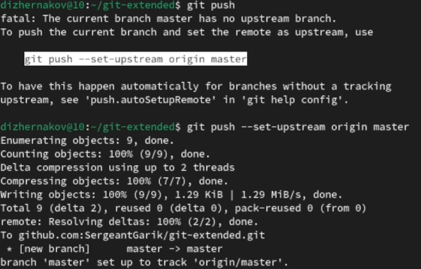{#fig:011 width=70%}

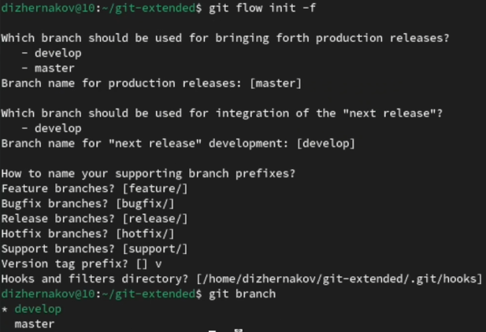{#fig:012 width=70%}

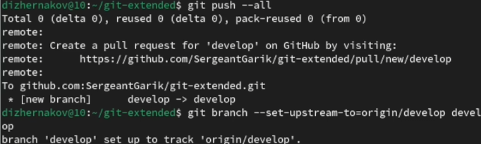{#fig:013 width=70%}

Выполняем конфигурацию для пакетов Node.js, с помощью команды *pnpm init* (рис. [-@fig:014])

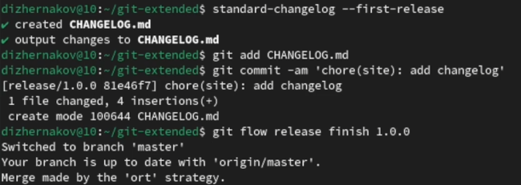{#fig:014 width=70%}

Далее заполняем несколько параметров пакета:
- название пакета
- лицензия пакета (предлагается выбирать лицензию CC-BY-4.0)
- формат коммитов. Для этого добавляем в файл package.json команду для формирования коммитов: *"config":*  (рис. [-@fig:015])

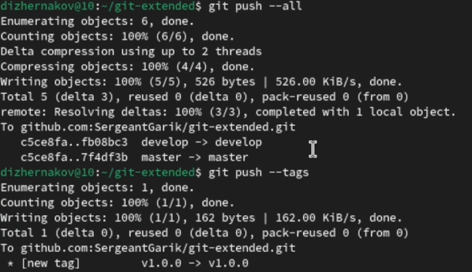{#fig:015 width=70%}

Далее я выполнила команду *sudo npm install commitizen -g*, так как у меня не работала команда *git cz*, которая нужна в дальнейшем (рис. [-@fig:016])

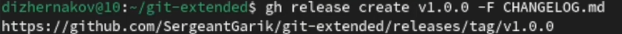{#fig:016 width=70%}

После добавляем новые файлы, выполняем коммит и отправляем на github, с помощью *git add .*, *git cz* и *git push* (рис. [-@fig:017]), (рис. [-@fig:018])

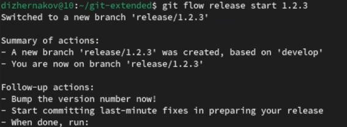{#fig:017 width=70%}

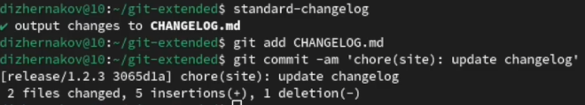{#fig:018 width=70%}

Далее инициализируем git-flow введя *git flow init*. Префикс для ярлыков устанавливаем в *v* (рис. [-@fig:019])

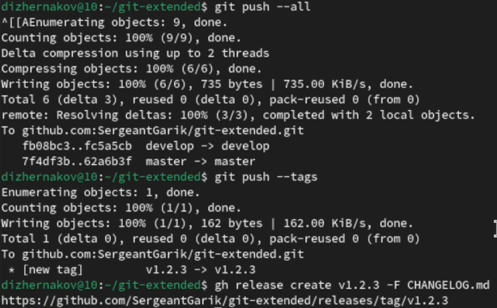{#fig:019 width=70%}

# Выводы

В ходе выполнения лабораторной рбаоты мы получили навыки правильной работы с репозиториями git, а также научились создавать релизы.

# Список литературы

1. Лаборатораня работа №4 [Электронный ресурс] URL: https://esystem.rudn.ru/mod/page/view.php?id=1098937#org5411099
2. Список лицензий [Электронный ресурс] URL: https://spdx.org/licenses/
